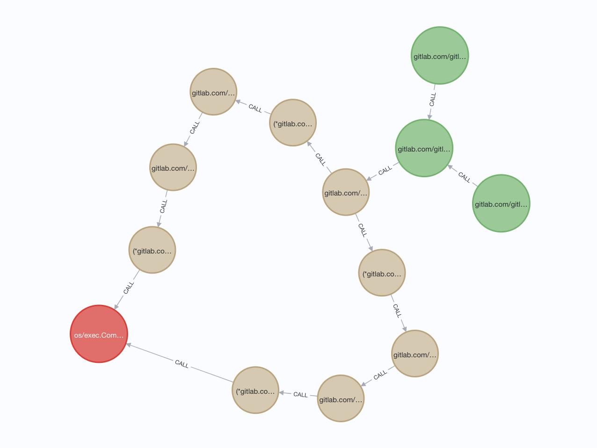

<div align="center">
  

 # goot
</div>

- [goot](#goot)
	- [What is goot?](#what-is-goot)
	- [Get started](#get-started)
	- [Use taint analysis](#use-taint-analysis)
	- [Save to neo4j](#save-to-neo4j)
	- [Use as a framework](#use-as-a-framework)
	- [Tips](#tips)
	- [Thanks](#thanks)
## What is goot?

[goot](https://github.com/cokeBeer/goot) is a static analysis framework for Go. goot is easy-to-learn, easy-to-use and highly extensible, allowing you to easily develop new analyses on top of it.

Currently, goot provides the following major analysis components (and more analyses are on the way):

- Control/Data-flow analysis framework
  - Control-flow graph construction
  - Classic data-flow analyses, e.g. taint analysis
  - Your dataflow analyses

## Get started

Intall goot by

```
go get -u github.com/cokeBeer/goot
```

##  Use taint analysis
Write code below in your project
```go
package main

import "github.com/cokeBeer/goot/pkg/example/dataflow/taint"

func main() {
	// if this file is cmd/taint/main.go
	// and you want to analyse package pkg
	// the path should be "../../pkg"
	// or "../../pkg..." for all packages under pkg
	runner := taint.NewRunner("relative/path/to/package")
	// for this project, is "github.com/cokeBeer/goot"
	runner.ModuleName = "module-name"
	runner.PassThroughDstPath = "passthrough.json"
	runner.CallGraphDstPath = "callgraph.json"
	runner.Run()
}
```
Run the code, and you will get a `passthrough.json` in the same directory, which contains taint passthrough information of all functions in your project\
You can see key `fmt.Sprintf` holds the value `[[0,1],[0],[1]]`
```json
{
    "fmt.Sprintf": [
        [0, 1], # return value's taint
	[0],    # first parameter's taint
	[1]	# second parameter's taint
    ]
}
```
This means three things
- the first parameter's taint and the second parameter's taint are passed to the first return value,
- the first parameter receives the first parameter's taint
- the second parameter receives the second parameter's taint

The rule is 
```json
{
	"function name": [ 
		["receiver taint"], # 0 or 1
		["result taint"],   # 0 or many
		["param taint"]     # 0 or many
	]
}
```
Also, you will get a `callgraph.json` in the same directory\
You can see the json file contains taint edges from one call parameter to another call parameter
```json
{
    "(*github.com/example/runnner.Runner).RunCmd#0#(*os/exec.Cmd).StdoutPipe#0": {
        "From": "(*github.com/example/runnner.Runner).RunCmd",
        "FromIndex": 0,
        "To": "(*os/exec.Cmd).StdoutPipe",
        "ToIndex": 0,
        "ToIsMethod": false,
        "ToIsSink": true,
        "ToIsSignature": false,
        "ToIsStatic": true
    }
}
```
This means there is a taint edge from position `0` of `RunCmd` (in this case, the parameter is the receiver `runner.Runner` itself ) to position `0` of `StdoutPipe` (in this case, the parameter is ther recevier `exec.Cmd` iteself, too)

## Save to neo4j
To view taint edges better, you can load them to neo4j by set these parameters (for more detailed options, see [options of runner](pkg/example/dataflow/taint/README.md))
```go
func main() {
	runner := taint.NewRunner("../../internal...")
	runner.ModuleName = "gitlab.com/gitlab-org/gitlab-workhorse"
	// parameters about neo4j
	runner.PersistToNeo4j = true
	runner.Neo4jURI = "bolt://localhost:7687"
	runner.Neo4jUsername = "neo4j"
	runner.Neo4jPassword = "password"
	err := runner.Run()
	if err != nil {
		log.Fatal(err)
	}
}
```
When analysis is end, you can find nodes and taint edges in your neo4j database\
For example, we run taint analysis on [gitlab.com/gitlab-org/gitlab-workhorse@v13.10.0](https://gitlab.com/gitlab-org/gitlab/-/tree/v13.10.0-ee/workhorse)，which has a RCE vulnerability [CVE-2021-22225](https://hackerone.com/reports/1154542)\
Using query below to find taint paths
```
MATCH (source:Source),(sink:Sink {name:"os/exec.CommandContext"}),p=(source)-[*7]->(sink) RETURN p
```
We can get a graph like this: (the red nodes are sink, the brown nodes are intra functions and the green nodes are source)

Which reveals two taint paths from source to sink `os/exec.CommandContext`, the same as [CVE-2021-22225](https://hackerone.com/reports/1154542)
## Use as a framework
To use goot as a framework, first create two structs implementing  `pkg/toolkits/scalar.FlowAnalysis` interface

```go
// FlowAnalysis represents a flow analysis
type FlowAnalysis interface {
	GetGraph() *graph.UnitGraph
	IsForward() bool
	Computations() int
	FlowThrougth(inMap *map[any]any, unit ssa.Instruction, outMap *map[any]any)
	NewInitalFlow() *map[any]any
	EntryInitalFlow() *map[any]any
	Copy(srcMap *map[any]any, dstMap *map[any]any)
	MergeInto(Unit ssa.Instruction, inout *map[any]any, in *map[any]any)
	End(universe []*entry.Entry)
}
```

and `pkg/golang/switcher.Switcher` interface seperately

```go
// Switcher represents a ssa instruction switcher
type Switcher interface {
	CaseAlloc(inst *ssa.Alloc)
	CasePhi(inst *ssa.Phi)
	CaseCall(inst *ssa.Call)
	CaseBinOp(inst *ssa.BinOp)
	CaseUnOp(inst *ssa.UnOp)
	...
	CaseGo(inst *ssa.Go)
	CaseDefer(inst *ssa.Defer)
	CaseSend(inst *ssa.Send)
	CaseStore(inst *ssa.Store)
	CaseMapUpdate(inst *ssa.MapUpdate)
	CaseDebugRef(inst *ssa.DebugRef)
}
```

Don't worry for these apis. An easy way to implement them is using compose like `pkg/toolkits/scalar.BaseFlowAnalysis`

```go
// ConstantPropagationAnalysis represents a constant propagtion analysis
type ConstantPropagationAnalysis struct {
	scalar.BaseFlowAnalysis
	constantPropagationSwitcher *ConstantPropagationSwitcher
}
```

and `pkg/golang/switcher.BaseSwitcher`

```go
// ConstantPropagationSwitcher represents a constant propagtion switcher
type ConstantPropagationSwitcher struct {
	switcher.BaseSwitcher
	constanctPropagationAnalysis *ConstantPropagationAnalysis
	inMap                        *map[any]any
	outMap                       *map[any]any
}
```

These can make you focus on the core methods you really need to design carefully in specific analyses\
You can learn more information about **how to use goot as a framework** and **how to run an analysis** from a tiny example I prepared for you in [how to use](pkg/example/dataflow/constantpropagation) and [how to run](cmd/constantpropagationanalysis/) which demonstrates a `constant propagation analysis`


## Tips

- goot's api is similar to [soot](https://github.com/soot-oss/soot), so if you wonder how goot's api work, you can [learn soot](https://github.com/soot-oss/soot/wiki/Implementing-an-intra-procedural-data-flow-analysis-in-Soot) first
- goot uses `*map[any]any` as flow and `ssa.Instruction` as unit, so please be careful of type assertion

## Thanks

- [soot](https://github.com/soot-oss/soot)
- [Tai-e](https://github.com/pascal-lab/Tai-e)
